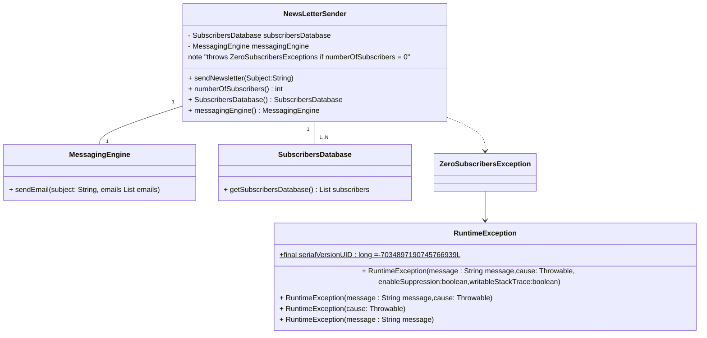

```mermaid
classDiagram 

    NewsLetterSender "1"--"1" MessagingEngine
    NewsLetterSender "1"--"1..N" SubscribersDatabase
    NewsLetterSender ..> ZeroSubscribersException
    ZeroSubscribersException --> RuntimeException


class NewsLetterSender {
     - SubscribersDatabase subscribersDatabase
    - MessagingEngine messagingEngine

    + sendNewsletter(Subject:String)
    note "throws ZeroSubscribersExceptions if numberOfSubscribers = 0"

    + numberOfSubscribers() int 
    + SubscribersDatabase() SubscribersDatabase
    + messagingEngine() MessagingEngine
}

class SubscribersDatabase{
    + getSubscribersDatabase() List<String> subscribers
}

class MessagingEngine{
    + sendEmail(subject: String, emails List<String> emails)
}

class ZeroSubscribersException

class RuntimeException{
    +final serialVersionUID : long =-7034897190745766939L$
    + RuntimeException(message : String message,cause: Throwable, enableSuppression:boolean,writableStackTrace:boolean)
     + RuntimeException(message : String message,cause: Throwable)
    + RuntimeException( cause: Throwable)
    + RuntimeException(message : String message)
}

```

