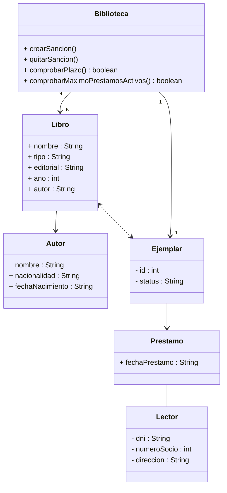

```mermaid

classDiagram

Libro --> Autor
Biblioteca "N"-->"N" Libro
Biblioteca "1"-->"1" Ejemplar
Libro <..>Ejemplar
Ejemplar ""-->"" Prestamo
Prestamo ""--"" Lector
class Libro{
    + nombre : String
    + tipo : String
    + editorial : String
    + ano : int
    + autor : String
}

class Ejemplar{
- id : int
- status : String
}

class Biblioteca{
    + crearSancion()
    + quitarSancion()
    + comprobarPlazo() boolean
    + comprobarMaximoPrestamosActivos() boolean
}

class Prestamo{
+ fechaPrestamo : String
}

class Autor {
    + nombre : String
    + nacionalidad : String
    + fechaNacimiento : String
}

class Lector{
    - dni : String
    - numeroSocio : int
    - direccion : String
}

```